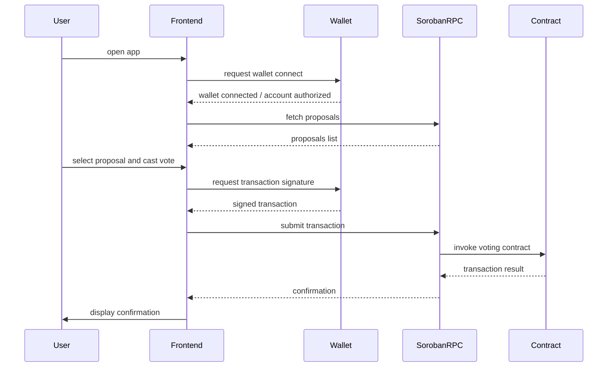

# Frontend ↔ Contract Interaction Flow

This document describes the user flow between the frontend, wallet, Soroban RPC, and the on-chain contract.

## Flow steps

1. **Wallet connect** — the frontend requests a wallet connection and account authorization.
2. **Fetch proposals** — the frontend queries Soroban RPC for current proposals and status.
3. **Cast vote** — the user selects a proposal and vote option in the UI.
4. **Transaction submission** — the frontend asks the wallet to sign and submit the vote transaction.
5. **Confirmation** — Soroban RPC returns a final transaction result, which the frontend surfaces to the user.
